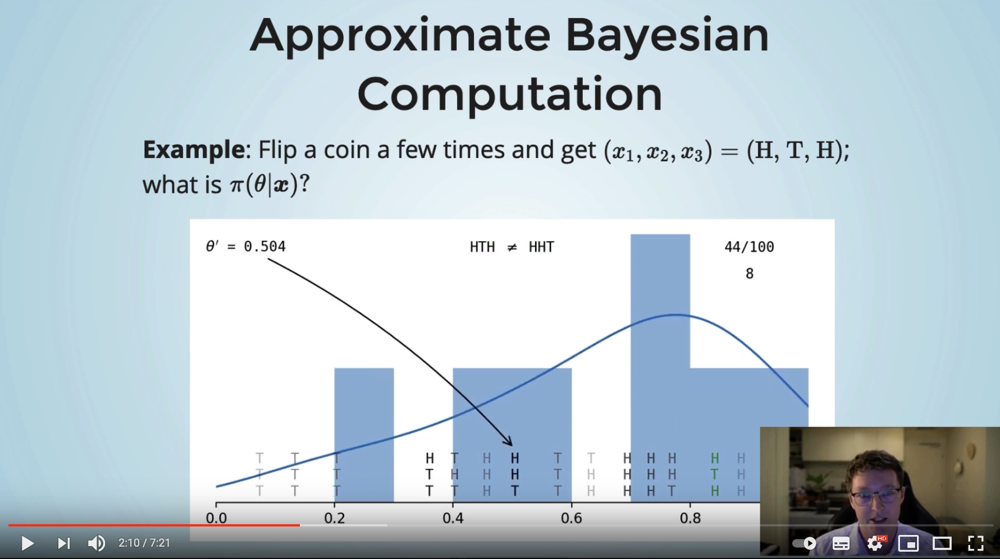

# The Python package _approxbayescomp_ for Approximate Bayesian Computation

## Package Description

This package implements an efficient _Approximate Bayesian Computation (ABC)_ algorithm &mdash; the _sequential Monte Carlo (SMC)_ algorithm. It was designed to fit insurance loss distributions, though it can handle any general statistical problem.

## Installation

To install simply run

`pip install approxbayescomp`

Soon, it will be possible to install using `conda`; at that point the preferred method will be to run

`conda install approxbayescomp`

The source code for the package is available on [Github](https://github.com/Pat-Laub/approxbayescomp).

## Example

### Using a built-in data generating process simulation method

Consider a basic insurance example where each month our insurance company receives a random number of claims, each of which is of a random size.
Specifically, say that in month $i$ we have $N_i \sim \mathsf{Poisson}(\lambda)$ i.i.d. number of claims, and each claim is $U_{i,j} \sim \mathsf{Lognormal}(\mu, \sigma^2)$ sized and i.i.d.
<!-- In other words, $\log(U_{i,j}) \sim \mathsf{Normal}(\mu, \sigma^2)$. -->
At each month we can observe the aggregate claims, that is,
\( X_i = \sum_{j=1}^{N_i} U_{i,j} \)
for $i=1,\dots,T$, that is, we observe $T$ months of data.
Lastly, we have the prior beliefs that $\lambda \sim \mathsf{Unif}(0, 100),$ $\mu \sim \mathsf{Unif}(-5, 5),$ and $\sigma \sim \mathsf{Unif}(0, 3).$

The `approxbayescomp` code to fit this data would be:

``` python

```

Then `fit` will contain a collection of weighted samples from the approximate posterior distribution of $(\lambda, \mu, \sigma)$.
The _posterior mean_ for these parameters would be easily calculated:

``` python
print("Posterior mean of lambda: ", np.sum(fit.samples[:, 0] * fit.weights))
print("Posterior mean of mu: ", np.sum(fit.samples[:, 1] * fit.weights))
print("Posterior mean of sigma: ", np.sum(fit.samples[:, 2] * fit.weights))
```

### Using a user-suppled simulation method 

We have built many standard insurance loss models into the package, so in the previous example

```python
model = abc.Model("poisson", "lognormal", abc.Psi("sum"), prior)
```

is all that is required to specify this data-generating process.
However, for non-insurance processes, we have to supply a function to simulate from the data-generating process.
The equivalent version for this example would be:

```python
import numpy as np

def simulate_aggregate_claims(rg, theta, T):
    """
    Generate T observations from the model specified by theta
    using the random number generator rg.
    """
    lam, mu, sigma = theta
    freqs = rg.poisson(lam, size=T)
    aggClaims = np.empty(T, np.float64)
    for t in range(T):
        aggClaims[t] = np.sum(rg.lognormal(mu, sigma, size=freqs[t]))
    return aggClaims

simulator = lambda rg, theta: simulate_aggregate_claims(rg, theta, len(obsData))
model = abc.SimulationModel(simulator, prior)
```

Modifying just these lines will generate the identical output as the example above.

## Other Examples and Resources

See the [What is ABC](what-is-abc/) page for an illustrative example of the core ABC concept.
For examples of this package in use, start with the [Geometric-Exponential example](geometric-exponential/) page and the following ones.

This package is the result of our paper "[Approximate Bayesian Computation to fit and compare insurance loss models](https://arxiv.org/abs/2007.03833)".
For a detailed description of the aims and methodology of ABC check out this paper.
It was written with ABC newcomers in mind.

If you prefer audio/video, see Patrick's 7 min lightning talk at the Insurance Data Science conference:

<figure markdown>
  [{ width="500" }](https://www.youtube.com/watch?v=EtZdCWoFMBA)
  <figcaption><a href="https://www.youtube.com/watch?v=EtZdCWoFMBA">ABC Talk at Insurance Data Science conference</a></figcaption>
</figure>


## Details

The main design goal for this package was computational speed.
ABC is notoriously computationally demanding, so we spent a long time optimising the code as much as possible.
The key functions are JIT-compiled to C with `numba` (we experimented with JIT-compiling the entire SMC algorithm, but `numba`'s random variable generation is surprisingly slower than `numpy`'s implementation).
Everything that can be `numpy`-vectorised has been.
And we scale to use as many CPU cores available on a machine using `joblib`.
We also aimed to have total reproducibility, so for any given seed value the resulting ABC posterior samples will always be identical.

Our main dependencies are joblib, numba, numpy, and scipy.
The package also uses matplotlib, fastprogress, and hilbertcurve, though these could be removed if necessary.

!!! note

    Patrick has a rough start at a C++ version of this package at the [cppabc](https://github.com/Pat-Laub/cppabc) repository.
    It only handles the specific Geometric-Exponential random sums case, though if you are interested in collaborating to expand this, let him know!

## Authors

- [Patrick Laub](https://pat-laub.github.io/) (author, maintainer),
- [Pierre-Olivier Goffard](http://pierre-olivier.goffard.me/) (author).

## Citation

Pierre-Olivier Goffard, Patrick J. Laub (2021), _Approximate Bayesian Computations to fit and compare insurance loss models_, Insurance: Mathematics and Economics, 100, pp. 350-371

```bibtex
@article{approxbayescomp,
  title={Approximate Bayesian Computations to fit and compare insurance loss models},
  author={Goffard, Pierre-Olivier and Laub, Patrick J},
  journal={Insurance: Mathematics and Economics},
  volume={100},
  pages={350--371},
  year={2021}
}
```